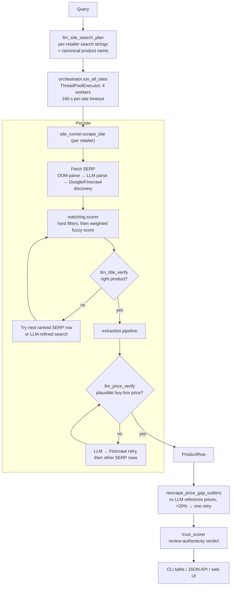

# ScrapeGoat — Shopping Websites Scraper

Type a product name and get the price, rating, and review count from **Amazon**,
**Best Buy**, **Walmart**, and **Newegg** side by side — fetched live at the
moment you ask, not read out of a stale database.

All four retailers actively block automated access, so a single scraping
strategy fails most of the time. ScrapeGoat runs a four-stage fallback pipeline
per site and escalates only as far as it has to, then uses an LLM as a
_referee_ — verifying that the matched listing is really the product you asked
for and that the scraped price is plausible — rather than as the primary
extractor.


> **Heads up before you clone:** the root `package.json` and `.env.example` are
> still excluded by `.gitignore`, so the `npm run …` shortcuts and
> `cp .env.example .env` do not work from a clone. `web/` installs fine — its
> manifest is committed. See [Known gaps](#known-gaps).
>
> **Every LLM check fails open.** With no key, no credits, or an unreachable
> API, the pipeline still returns results — it just stops verifying them. See
> [When the LLM is unavailable](#when-the-llm-is-unavailable) for what the run
> tells you when that happens.

---

## How it works



### The extraction pipeline

`extraction/pipeline.py` tries each stage in order and stops at the first
success. Every stage is more expensive and more detectable than the last.

| Stage | Method                               | Notes                                                                                                                                     |
| ----- | ------------------------------------ | ----------------------------------------------------------------------------------------------------------------------------------------- |
| 1     | `curl_cffi` HTTP GET + BeautifulSoup | Chrome TLS fingerprint impersonation, rotating across `chrome136/131/124/120`, with full `Sec-Ch-*`/`Sec-Fetch-*` headers. Cheapest path. |
| 2     | Playwright                           | Real browser load, per-site readiness selectors, human-like settle delay.                                                                 |
| 3     | LLM extraction                       | Visible text from the **cached** stage-2 HTML sent to the model for structured fields — no extra page fetch when stage 2 already ran.     |
| 4     | Firecrawl API                        | Last resort, when everything local has failed.                                                                                            |

> **Firecrawl actually runs _first_, not fourth, whenever `FIRECRAWL_API_KEY` is
> set.** `_run_core_pipeline` attempts Firecrawl before stage 1 and returns
> immediately on success; the numbered stages are the fallback path. Unset the
> key to get the strict 1→4 order.

Each site adapter (`sites/`) supplies the search URL, SERP parser, product-page
parser, readiness selectors, and bot-check patterns. `SiteAdapter` also provides
a shared JSON-LD parser, which is the fast path when a retailer publishes
structured data.

### Where the LLM is used

Six distinct jobs, none of which is "scrape the page for me" by default:

| Module                 | Job                                                                                                                      |
| ---------------------- | ------------------------------------------------------------------------------------------------------------------------ |
| `llm_site_search_plan` | Turn one user query into per-retailer search strings plus a canonical product name to match against                      |
| `llm_extract`          | Structured field extraction (stage 3) and SERP parsing when the DOM parser finds nothing                                 |
| `llm_title_verify`     | Gate before extraction: is this SERP listing actually the requested product? Can return a refined search query           |
| `llm_price_verify`     | Gate after extraction: is this a plausible buy-box price, or did we grab an accessory/subscription/strikethrough number? |
| `llm_price_benchmark`  | Reference prices for the whole query, used to spot outliers                                                              |
| `trust_scorer`         | Review-authenticity verdict (`High`/`Medium`/`Low`) from the rating/review-count pattern                                 |

### Matching

`matching/scorer.py` runs **hard filters first** — any hit scores 0 and the
candidate is dropped outright:

`accessory` · `earbuds vs headphones` · `bundle` · `screen size` ·
`model code` · `chip generation` · `year`

These exist because fuzzy similarity is actively misleading on retail titles: a
case for a tablet shares almost every token with the tablet itself. Survivors
get a weighted score:

```
0.55 × WRatio  +  0.25 × token_set_ratio  +  0.15 × model_token_recall
     + 0.05 × year_bonus  −  bundle_penalty  −  condition_penalty
```

Accepted at `min_match_score` **48.0**, or down to a soft floor of **42.0** when
the model tokens line up. Non-new listings (renewed, refurbished, open-box) are
filtered unless the query asks for them.

### Price-gap second pass

After all sites return, `rescrape_price_gap_outliers` compares each scraped
price against the LLM reference for that retailer. Anything more than **20%**
off gets exactly one re-scrape. This catches the classic failure where a parser
locks onto a strikethrough list price, a bundle total, or a monthly financing
amount instead of the buy-box price.

---

## Setup

```bash
git clone https://github.com/rondahan04/shopping_websites_scraper.git
cd shopping_websites_scraper

python3 -m venv .venv
source .venv/bin/activate            # Windows: .venv\Scripts\activate
pip install -r requirements.txt
pip install curl_cffi                # missing from requirements — see Known gaps
playwright install chromium
```

Create `.env` in the project root (there is no `.env.example` in the repo — see
[Known gaps](#known-gaps)):

```bash
OPENAI_API_KEY=sk-...                # required
FIRECRAWL_API_KEY=fc-...             # optional; when set, Firecrawl runs first
```

Playwright browsers install into `.playwright-browsers/` inside the project —
`config.py` sets `PLAYWRIGHT_BROWSERS_PATH` before Playwright loads, so nothing
lands in your home directory.

---

## CLI

```bash
python main.py "Lenovo Tab P12-2024"
python main.py                       # prompts for the query
```

| Flag                      | Purpose                                                                                |
| ------------------------- | -------------------------------------------------------------------------------------- |
| `query` (positional)      | Product to search for; prompted if omitted                                             |
| `-q`, `--quiet`           | Warnings only                                                                          |
| `--save-html DIR`         | Dump per-site SERP and product HTML for parser debugging (`html_debug/` is gitignored) |
| `--no-price-gap-rescrape` | Skip the price-outlier second pass                                                     |

Output columns: `Website | Product title | Price | Average rating | Review count | Status | Method`.

**Exit code `0` when at least 3 of 4 sites return a price, `2` otherwise** — so
it is usable in a scripted check. A partial result is still printed.

Expect a few minutes per query: four sites run in parallel, but browser stages
and deliberate settle delays dominate.

---

## Configuration

All optional, all read from the environment at import time (`config.py`).

| Variable                                  | Default                 | Effect                                                          |
| ----------------------------------------- | ----------------------- | --------------------------------------------------------------- |
| `OPENAI_API_KEY`                          | —                       | **Required.** Every LLM stage no-ops without it                 |
| `OPENAI_MODEL`                            | `gpt-5.4-mini`          | Model for all six LLM jobs                                      |
| `FIRECRAWL_API_KEY`                       | —                       | Enables Firecrawl, and moves it to the front of the pipeline    |
| `PRICE_GAP_RESCRAPE`                      | `true`                  | Master switch for the second pass                               |
| `PRICE_GAP_RESCRAPE_THRESHOLD`            | `0.20`                  | Relative gap that triggers a re-scrape                          |
| `LLM_TITLE_VERIFY`                        | `true`                  | Pre-extraction listing check                                    |
| `LLM_PRICE_VERIFY`                        | `true`                  | Post-extraction price plausibility check                        |
| `MIN_MATCH_SCORE_SOFT_FLOOR`              | `42.0`                  | Clamped to ≤ 47.9 so it stays under `min_match_score`           |
| `PAGE_SETTLE_MIN_S` / `PAGE_SETTLE_MAX_S` | `3.0` / `8.0`           | Random post-navigation pause; swapped automatically if inverted |
| `API_ORIGIN`                              | `http://127.0.0.1:8000` | Where the Next.js dev server proxies `/api/*`                   |

Booleans accept `0`/`false`/`no`/`off` as false; anything else is true.

> `FIRECRAWL_APY_KEY` (sic) is accepted as a fallback spelling of
> `FIRECRAWL_API_KEY`. It is a typo that became load-bearing — keep it in mind
> if a key appears to be ignored.

Tuning constants not exposed as env vars live in the `Settings` dataclass:
`search_timeout_s` 20 s, `product_timeout_s` 30 s, `playwright_timeout_ms`
35 s, `min_match_score` 48.0, `ambiguity_delta` 5.0, `max_serp_results` 15,
`llm_max_chars` 20,000, `max_workers` 4.

---

## HTTP API

```bash
source .venv/bin/activate
uvicorn api.main:app --port 8000 --reload
```

Scrapes take minutes, so the API is **job-based** — start a job, then poll. A
synchronous endpoint would hit browser and proxy timeouts.

| Endpoint                        | Purpose                                                                                            |
| ------------------------------- | -------------------------------------------------------------------------------------------------- |
| `GET /health`                   | Liveness                                                                                           |
| `POST /api/search/jobs`         | `{ "query": "...", "rescrape_price_gaps": true }` → `{ "job_id": "..." }`                          |
| `GET /api/search/jobs/{job_id}` | Poll until `status` is `done`; carries progress percent, per-store completion, and the result rows |

Expired or unknown job IDs return 404. CORS is open to `localhost:3000` and
`127.0.0.1:3000` only.

Each row includes `method` (which pipeline stage produced it), `source_url`,
and `trust_label`/`trust_reason` — so a solid number is distinguishable from a
shaky one.

---

## Web UI

A Next.js front end in `web/` — matrix-green terminal aesthetic, live progress
bar, sortable results table, and a playable mini-game to pass the time while a
scrape runs (`WaitGame.tsx`).

```bash
cd web && npm install && npm run dev     # http://localhost:3000
```

`next.config.ts` rewrites `/api/*` and `/health` to `API_ORIGIN`, so the browser
only ever talks to the Next.js origin.

---

## Repository layout

| Path              | Role                                                                                |
| ----------------- | ----------------------------------------------------------------------------------- |
| `main.py`         | CLI entry point                                                                     |
| `config.py`       | `Settings` dataclass, env parsing, bot-detection patterns                           |
| `models.py`       | `ProductRow`, `ProductFields`, `SearchResult`, `ExtractionMethod`                   |
| `orchestrator.py` | Parallel site runs, per-site timeout, price-gap second pass                         |
| `site_runner.py`  | Per-site search → match → verify → extract, plus every fallback path                |
| `sites/`          | Retailer adapters (`amazon`, `bestbuy`, `walmart`, `newegg`) over `SiteAdapter`     |
| `extraction/`     | Fallback pipeline, the six LLM jobs, SERP discovery, trust scorer                   |
| `matching/`       | Normalisation, hard conflict filters, weighted scorer, condition handling           |
| `utils/`          | `curl_cffi` fetch, browser profiles, human-like behaviour, page settle, URL helpers |
| `validation/`     | Field sanity checks and bot-page detection                                          |
| `output/`         | Console table rendering                                                             |
| `api/`            | FastAPI app, job store, progress + timeline logging                                 |
| `web/`            | Next.js UI                                                                          |

`site_runner.py` is by far the densest file (~31 KB) — most of it is recovery
logic for the ways a match can go wrong: accessory rows that survive scoring,
hallucinated PDP URLs from search-engine discovery, 404s on a matched listing,
and prices that fail verification.

---

## Troubleshooting

| Symptom                                           | Cause / fix                                                                                                                               |
| ------------------------------------------------- | ----------------------------------------------------------------------------------------------------------------------------------------- |
| `ModuleNotFoundError: curl_cffi`                  | Not in `requirements.txt`. `pip install curl_cffi`.                                                                                       |
| `npm run api` / `npm run web` not found           | Those scripts live in a root `package.json` that is gitignored. Use `uvicorn api.main:app --port 8000`.                                   |
| `cp .env.example .env` fails                      | `.env.example` is gitignored. Create `.env` by hand — see [Setup](#setup).                                                                |
| `429 insufficient_quota` in the logs              | OpenAI account is out of credits. The run continues with every check failing open — read the `WARNING: some checks did not run` summary under the table. |
| Results look verified but nothing was checked     | They probably weren't. See [When the LLM is unavailable](#when-the-llm-is-unavailable); logs say `UNAVAILABLE — accepting … unchecked`.    |
| Every site returns Failed                         | Missing `OPENAI_API_KEY` — the search-plan step runs before any fetch.                                                                    |
| One site consistently fails                       | Not always a bot wall — check the stage errors first. `ERR_HTTP2_PROTOCOL_ERROR` is a transport failure and a Firecrawl `500` is upstream, neither of which is a block. For a real wall, `--save-html ./html_debug` and look for a CAPTCHA or challenge page (`GENERIC_BOT_PATTERNS` in `config.py`). |
| Prices look like list price, not buy-box          | The price verifier should catch it. Confirm `LLM_PRICE_VERIFY` is on and the model has a valid key.                                       |
| Correct product, wrong variant (size/colour/year) | Tune the hard filters in `matching/normalize.py`; scoring alone will not separate near-identical titles.                                  |
| Runs take 5+ minutes                              | Expected. Settle delays are 3–8 s per navigation by design; lower `PAGE_SETTLE_MIN_S`/`MAX_S` to speed up at higher block risk.           |
| Site marked unavailable with no error             | 240 s per-site cap in `orchestrator.run_all_sites`.                                                                                       |

---

## When the LLM is unavailable

Six things in this pipeline are model judgements: the per-retailer search plan,
the LLM extraction fallback, the SERP title verify, the scraped-price verify,
the price benchmark behind the outlier rescrape, and the review-trust score.

**All six fail open.** If the API key is missing, out of credits, or the call
errors, the scrape continues and whatever was being judged is accepted. That is
the intended default — a scrape with no verification beats no scrape — but it
means a degraded run produces rows that look exactly like verified ones.

Two guards keep that from being invisible:

**`verified` on the verify results.** `TitleVerifyResult` and
`PriceVerifyResult` carry `verified` alongside `match` / `plausible`. A caller
can therefore tell "the model said this is the right product" from "nobody
looked" — both of which arrive as a pass. Logs say `UNAVAILABLE — accepting …
unchecked` rather than `OK`.

**`extraction/llm_health.py`.** Components register when they degrade. The CLI
prints the summary to stderr under the results table:

```
WARNING: some checks did not run — results below are unverified, not verified-and-passed.
  - title verify: listings accepted without checking they are the same product
      cause: Error code: 429 - ... You have no credits remaining ...
  - trust scoring: review-trust labels come from the heuristic, not the model
      cause: Error code: 429 - ...
```

The API returns the same information as `checks_skipped` on the search
response, and the web UI renders it above the results. When trust scoring
degrades, its labels come from a two-rule heuristic over rating and review
count — the panel says so instead of calling itself AI analysis.

Note the API's report is **process-wide, not per-job**: jobs run in concurrent
threads over shared state, and the realistic cause applies to every job in the
process anyway. A one-off failure keeps being reported until restart. That errs
toward disclosure, which is the direction a safety signal should err in.

---

## Known gaps

- **The root `package.json` and `.env.example` are still unpublished.**
  `.gitignore` excludes them under a "Local-only (solo dev — not published)"
  heading, along with `tests/`, `docs/`, and `scripts/`, so `npm run api`,
  `npm run web` and `cp .env.example .env` cannot work from a clone. `web/`
  is fixed — `web/package.json` and its lockfile are committed, so the UI now
  installs from a fresh clone.
- **`curl_cffi` is missing from `requirements.txt`** even though
  `utils/http_fetch.py` imports it at module load, so stage 1 dies on a fresh
  install.
- **`pytest` is in `requirements.txt` but `tests/` is gitignored.** There are no
  runnable tests in the published repo.
- **`utils/scrapling_fetch.py` is dead code.** Nothing imports it, yet
  `scrapling[fetchers]` — a heavy dependency — is still required. Drop one or
  wire up the other.
- **LLM cost and non-determinism are real.** A single query can invoke the model
  six-plus ways, and the price benchmark, title verify, and trust score are all
  model judgements. Two runs of the same query can disagree.
- **Selector rot is the default state.** Retailer DOMs change without notice;
  when a site starts failing, assume the parser before the network.
- **US retail assumed throughout** — USD parsing, `.com` domains, and
  US-market price expectations in the LLM prompts.

---

## Scraping responsibly

This project fetches public product pages, and it does so with rotating browser
profiles, Chrome TLS impersonation, and human-like pacing — techniques that
exist here to survive aggressive bot walls on a low-volume personal lookup, not
to conduct bulk harvesting.

If you run it: keep the volume low, leave the settle delays alone, and check the
terms of service and `robots.txt` of any site you point it at. Automated access
is restricted or prohibited by several of these retailers' terms. Prices and
ratings belong to the retailers; treat anything it returns as a best-effort
reading, not an authoritative quote.

---

## Attribution

Built with [Playwright](https://playwright.dev/),
[curl_cffi](https://github.com/lexiforest/curl_cffi),
[BeautifulSoup](https://www.crummy.com/software/BeautifulSoup/),
[RapidFuzz](https://github.com/rapidfuzz/RapidFuzz),
[FastAPI](https://fastapi.tiangolo.com/), [Next.js](https://nextjs.org/), the
[OpenAI Python SDK](https://github.com/openai/openai-python), and
[Firecrawl](https://firecrawl.dev/).

Part of my [portfolio](https://www.rondahan.com/projects/scrapegoat).
